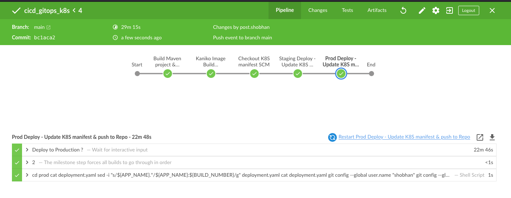
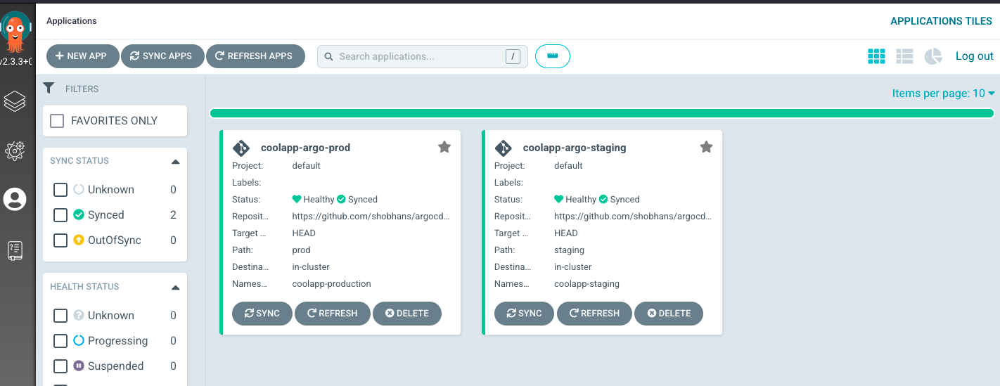

# CICD using GitOps with ArgoCD, Jenkins, Kubernetes, SpringBoot web application

CI part is achieved using Jenkins and for CD, ArgoCD is being used to deploy the Kubernetes manifests for SpringBoot application on Staging and Production namespaces on Kubernetes.

### Github repo for Kubernetes manifests

https://github.com/shobhans/argocd_app_k8s_manifests.git

### Pipeline stages


This repo includes Jenkinsfile for the pipeline and build template for jenkins agents on Kubernetes. The Jenkins pipeline contains following 6 stages with human intervention to proceed to production deploy (stage 6):

1. Declarative: Checkout SCM
2. Build Maven project & Archive Artifact
3. Kaniko Build & Push Image
4. Checkout K8S manifest SCM
5. Staging Deploy - Update K8S manifest & push to Repo
6. Prod Deploy - Update K8S manifest & push to Repo

### Docker image registry credential config for Kaniko

Kaniko needs dockerhub credential to push images to registry. The credential secret is mounted as a volume to the kaniko container inside jenkins agent pod. Create docker registry credential secret using the following command.

```bash
kubectl -n jenkins create secret docker-registry dockercred \
 --docker-server=https://index.docker.io/v1/ \
 --docker-username=my-docker-username \
 --docker-password='my-secret-password' \
 --docker-email=my-email@email.com
```

- Stages from 3 (Kaniko Build & Push Image) to 6 (Prod Deploy) only execute for 'main' branch.
- Tests are skipped to keep this demo simple.
- Container image is built using Kanino and pushed to Dockerhub image registry.
- Stage 5 and 6 update K8S manifest repo.
- ArgoCD monitors K8S manifests repo and creates/updates resources(deployment, service) on K8S.
- For automatic invocation of the Jenkins pipeline, you have to setup a Github webhook.
- On this demo, Jenkins is running within K8S (installed using helm chart, ref link provided below) and jobs are executed by its agents (template - builder.yaml).
- on builder.yaml, a persistentVolumeClaim 'maven-pv-claim' is used to cache repo dependencies for maven. This pvc must be created in prior. Using a pvc is optional; pvc not created, builder.yaml should be updated accordingly.

Services are using NodePort on this demo. To visit the running application after a successful deploy visit the following link:

- http://{type-node-ip-address}:30083 (staging)
- http://{type-node-ip-address}:30082 (prod)

### Links

- Install Jenkins on K8S using helm - https://www.jenkins.io/doc/book/installing/kubernetes/#install-jenkins-with-helm-v3
- Getting started with ArgoCD - https://argo-cd.readthedocs.io/en/stable/getting_started/
- Create SpringBoot App - https://start.spring.io/

### Screenshots



